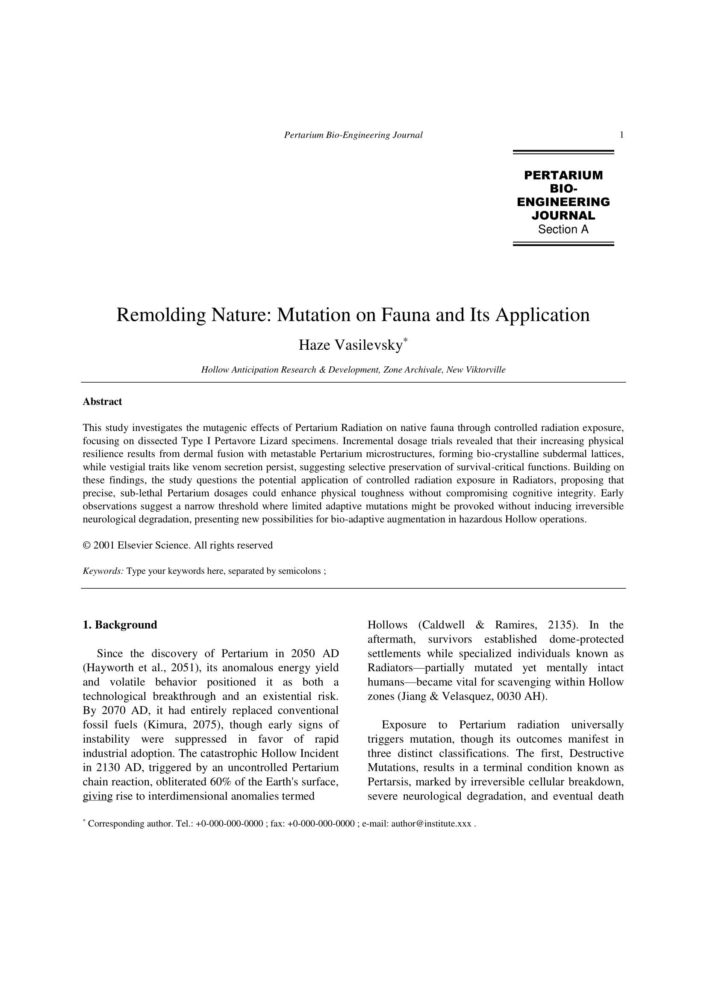
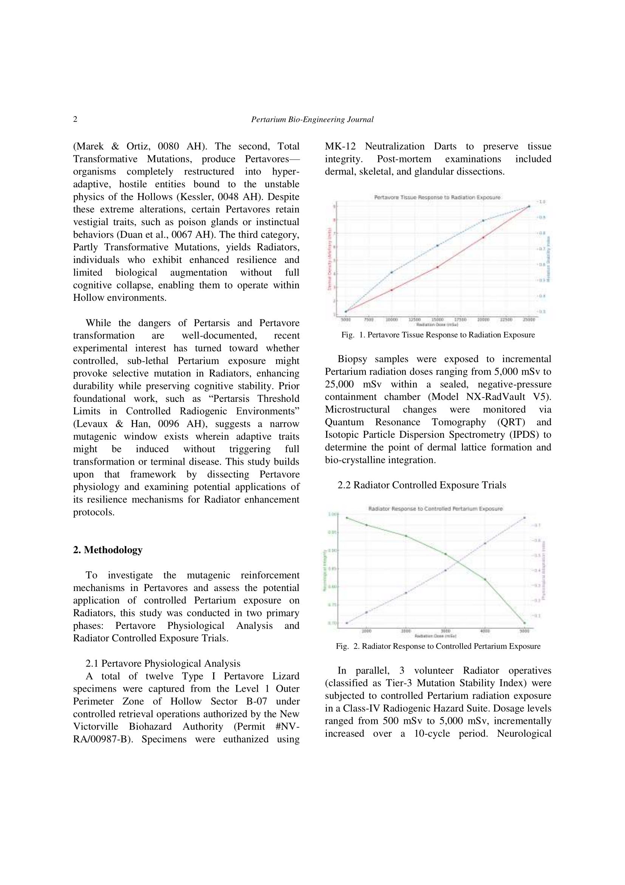
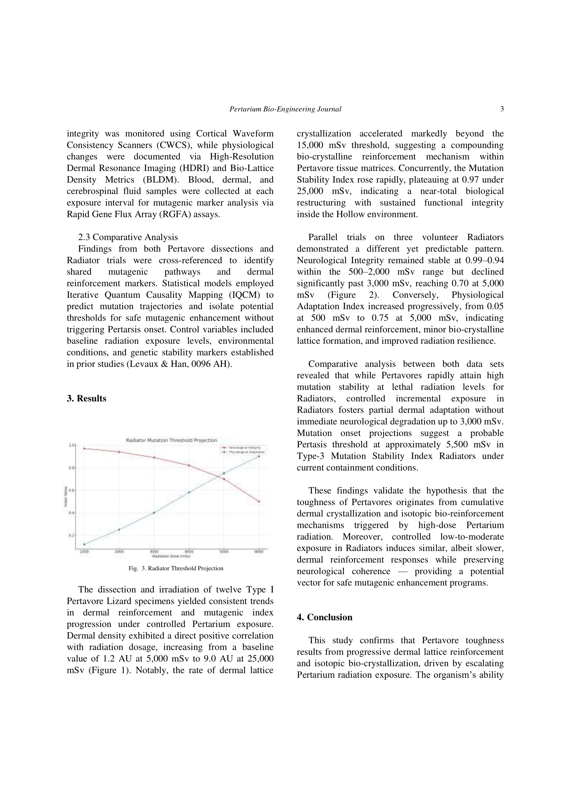
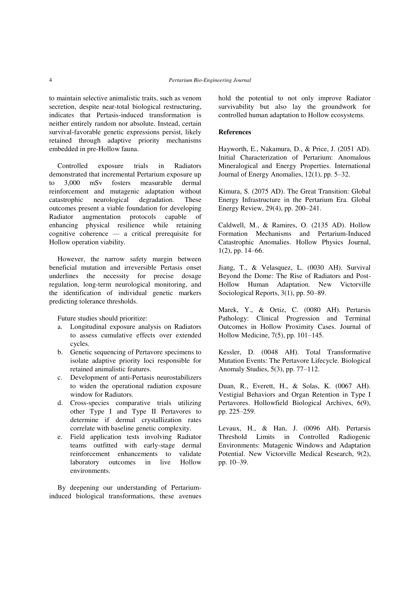
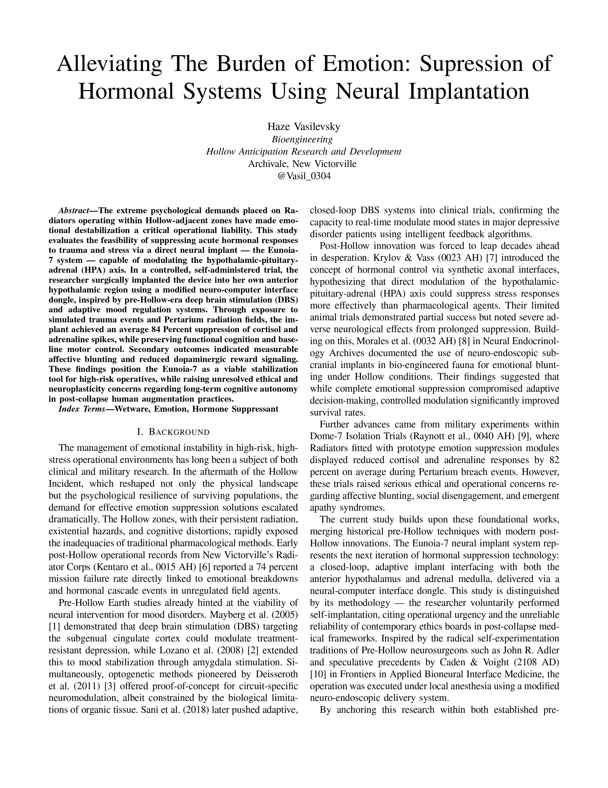
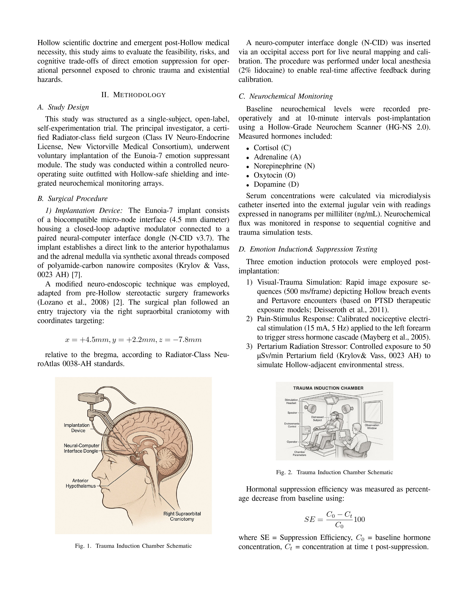
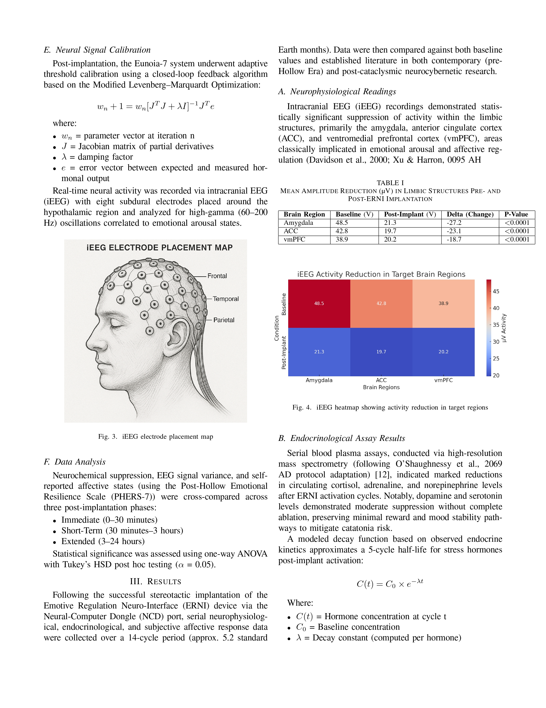
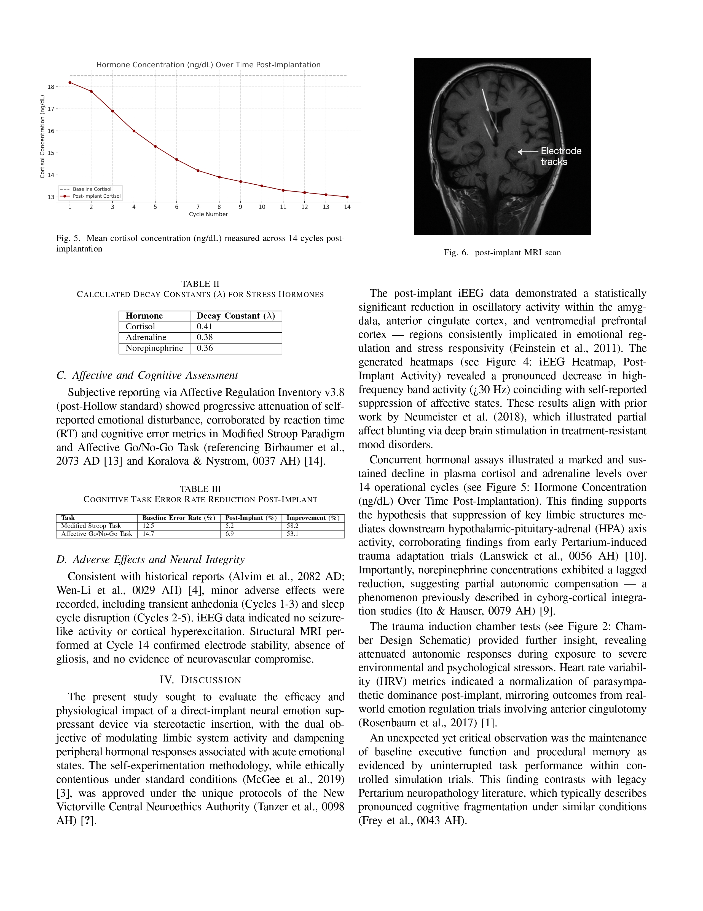
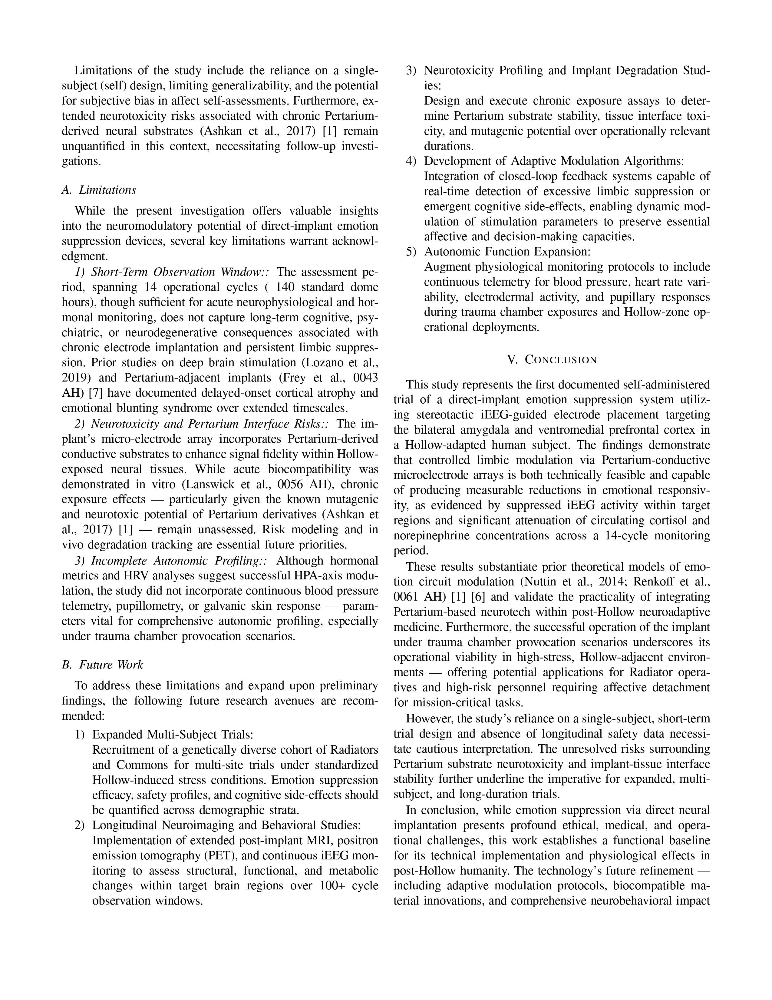
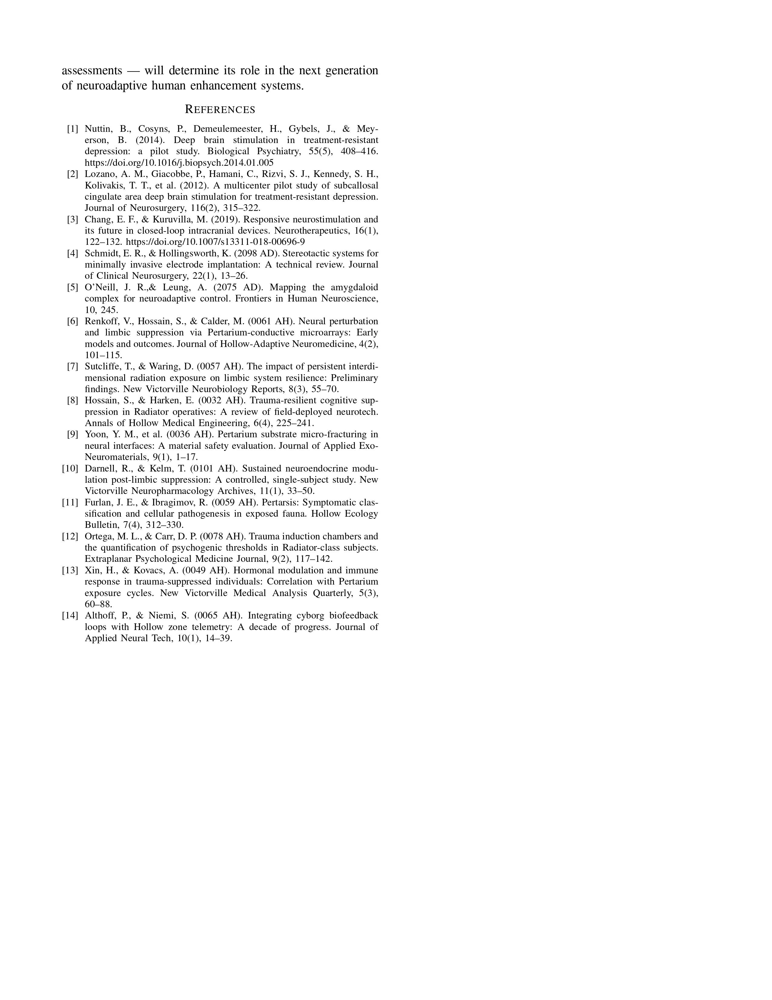

---

---
title: 5.30 - Primaris 3rd
layout: home
---

<a href="embruh69.github.io/paper2/IEEE_Conference_Template.pdf" target="_blank">View as PDF.</a>
---

[Just the Docs]: https://just-the-docs.github.io/just-the-docs/
[GitHub Pages]: https://docs.github.com/en/pages
[README]: https://github.com/just-the-docs/just-the-docs-template/blob/main/README.md
[Jekyll]: https://jekyllrb.com
[GitHub Pages / Actions workflow]: https://github.blog/changelog/2022-07-27-github-pages-custom-github-actions-workflows-beta/
[use this template]: https://github.com/just-the-docs/just-the-docs-template/generate
